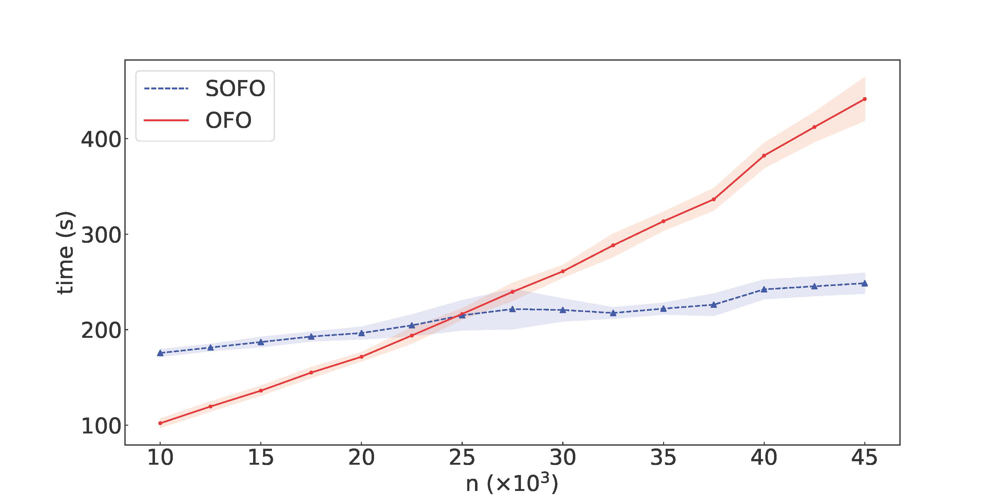

[](https://pubsonline.informs.org/journal/ijoc)

# Stochastic First-Order Algorithms for Constrained Distributionally Robust Optimization

This archive is distributed in association with the [INFORMS Journal on
Computing](https://pubsonline.informs.org/journal/ijoc).

The software and data in this repository are a snapshot of the software and data
that were used in the research reported on in the paper 
[Stochastic First-Order Algorithms for Constrained Distributionally Robust Optimization]() by Hyungki Im and Paul Grigas. 

## Licensing

### Software License

The source code included in this repository is distributed under the MIT License. The full license text can be found in the [LICENSE](LICENSE) file.

### Data License

The datasets provided in this repository are made available under the Creative Commons Attribution 4.0 International License (CC BY 4.0). Details of this license can be viewed in the [LICENSE_DATA](LICENSE_DATA) file, and further information is available on the [Creative Commons official page](https://creativecommons.org/licenses/by/4.0/).

## Cite

To cite the contents of this repository, please cite both the paper and this repo, using their respective DOIs.

<span style="color: red;">fill here.</span>


<span style="color: red;">fill here.</span>


Below is the BibTex for citing this snapshot of the respoitory.
<span style="color: red;">change this later.</span>

```
@misc{CacheTest,
  author =        {T. Ralphs},
  publisher =     {INFORMS Journal on Computing},
  title =         {{CacheTest}},
  year =          {2020},
  doi =           {10.1287/ijoc.2019.0000.cd},
  url =           {https://github.com/INFORMSJoC/2019.0000},
  note =          {Available for download at https://github.com/INFORMSJoC/2019.0000},
}  
```

## Description

The goal of this software is to demonstrate the effectiveness of the stochastic first-order method which is proposed in [Stochastic First-Order Algorithms for Constrained Distributionally Robust Optimization]() for constrained distributionally robust optimization.

## Prerequisites

Before you begin, ensure you have the necessary Python packages installed by referring to the `requirements.txt` file. Additionally, licenses for the commercial solvers [Gurobi](https://www.gurobi.com/) and [Mosek](https://www.mosek.com/) are required.


## Building

To compile the C code for the RedBlackTree, follow these steps:

1. Create a new virtual environment and install the Python packages specified in `requirements.txt`.
2. Activate the virtual environment and navigate to the `src/RBTree` directory.
3. Execute the `setup.py` script using Python to generate the C code from the `cython_RBTree.pyx` file:

   ```
   python setup.py build_ext --inplace
   ```
## Repository Structure

### Data

The `Data` folder contains the datasets used in our experiments. For the fairness machine learning example, we utilize a customized version of the [adult income dataset](https://archive.ics.uci.edu/dataset/2/adult) from UCI. All other experimental data are generated synthetically during runtime.

### Source Code

The `src` folder houses the source code for each experiment. Each subdirectory contains specific solvers including the stochastic online first-order (SOFO) approach (`SMD_Solver.py`), the online first-order (OFO) approach (`FMD_Solver.py`), and various utility functions (`UBRegret.py`, `test_functions.py`, `utils.py`). You can adjust the experiment parameters by modifying `test_functions.py`.

The `RBTree` subdirectory within `src` implements the RedBlackTree using C code, which must be built as described above.

### Scripts

The `scripts` folder includes Jupyter notebooks for running each experiment. For example, `n_num_test` compares the solving times of SOFO and OFO approaches by varying the number of samples (`n`). The `K_time_test` assesses the duality gap over time with different values of `K`. Detailed explanations are available within each notebook.

## Results

To conduct new experiments, run the corresponding Jupyter Notebook and modify the parameters as necessary. Results will be stored in the `results` folder, and those used in our publication are in the `submitted_results` folder.

## Replication

To replicate the results presented in our paper, adjust the parameters in the notebooks according to the settings specified in `test_functions.py`. For instance, to replicate the results for Figure 2-(a) in the Fairness ML experiment, modify the parameters in `FML_n_num_test.ipynb` as follows:

```
poly_degree = 3
n_list_nt = np.linspace(10000, 45000, 15)
repeats_num = 20
```

<div style="text-align: center;">
    
    <p style="text-align: center;">Figure 2-(a): Comparison of solving time between OFO and SOFO</p>
</div>

More details of parameters are presented in each Jupyter notebook. Adjusting these parameters will allow you to closely replicate the experiments and analyze the outcomes as documented in the paper. 

## Support

For support in using this software, submit an
[issue](https://github.com/INFORMSJoC/2023.0167/issues).
